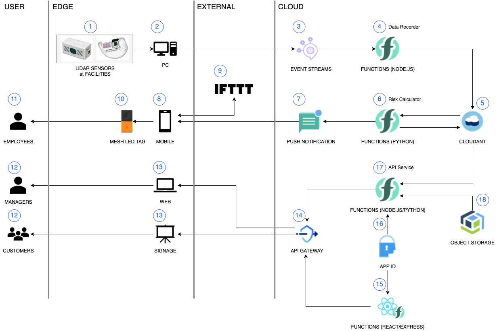
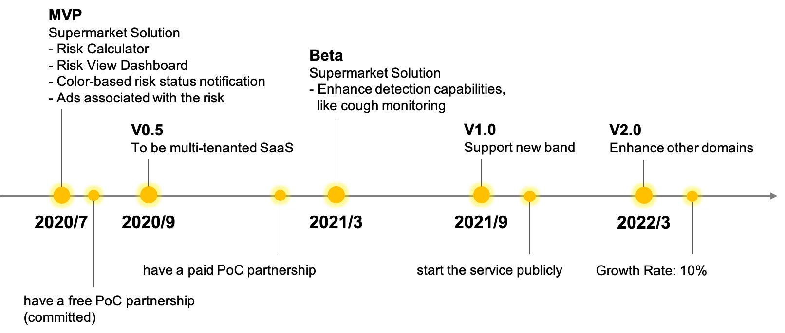

# COVSAFE

This is the solution package to shield employees and their customers from coronavirus infection by colorful, attractive, and indirect suggestions.

## Everything in it

## Live Demo

[COVSAFE](https://jp-tok.functions.appdomain.cloud/api/v1/web/1bccfb58-3612-476c-9d4b-db28f91bcf05/covsafe/view)

User ID is `user@fake.email`, so is password `password`.

## Solution Overview

### What is the problem?

Will copy from Santosh description.

### How can technology help?

Will copy from Santosh description

### The idea

Will copy from Santosh description

### The architecture

This is the COVSAFE system architecture.

Here is the flow how the system works.

1.  Sensors placed at facilities, like supermarkets, send raw data to the edge server. Sensors monitor congestion in the specific areas, people's behavior if they wash their hands, and garbage bins' status if it's disinfected.
2.  The edge server aggregates and cleanses sensor data, extract parts of data needed, and publishes them to the backend.
3.  The Event Streams service gets sensor data.
4.  The Data Recorder, running on the Node.js Functions, subscribes data sent by sensors and pushes them to Cloudant database.
5.  The Cloudant stores raw data.
6.  The Risk Calculator, running on the Python Functions, reads data from the Cloudant and calculates the risks of each cell of areas, employees, and garbage bins. Then, it pushes the result into the Cloudant database.
7.  The Risk Calculator pushes the calculation result to the Push Notification service if the result shows risk high. The push notification service pushes it to mobiles registered beforehand.
8.  The mobile phone gets notification, kicks our Indicator App. The app calls IFTTT webhook to send the notification.
9.  The IFTTT service calls the MESH App, running on the mobile, back. The MESH app sends the request to MESH via Bluetooth to change the color. The reason using IFTTT comes from the MESH specification. The only way to turn the LED light on is to kick IFTTT which calls the MESH app.
10.  The MESH gets the requests from the MESH app. The request includes what color should be changed. The device follows the request, switching the color to tell the current risk that the employees are exposed.
11.  Employees can see the color LED of MESH device to get known how much **SAFETY** they are easily.
12.  Either facility/shop managers or their customers can access our web portal to see how much safety the facilities are.
13.  The web browser, running on either the computers, the smart phones, or the digital signages, sends the requests to get our COVSAFE web portal.
14.  The API Gateway passes through above requests if the requests passes the client id authentication.
15.  The React App, running on Express on Functions, returns components of the web portal, like html, css, and javascript files if the requests pass the user authentication.
16.  The App ID verifies the user token given in the request from the React App.
17.  The brower sends requests to not only the React app but also the API service to get data, like the risk calculation result. The API service reads data from the Cloudant database and sends it back to the client.
18.  As well as the API service reads data from Cloudant, it obtains data, like static files, from the Cloud Object Storage.

Finally, the users, such as the managers and customers, can be informed **how mush safety** they are and the facilities are via both our web portal and colorful indications.

### Roadmap

We already built MVP, Minimum Value Product, and will have a PoC, Proof of Concept, in August with one of developers (the property management companies). On that PoC, we would like to verify how much the COVSAFE works. In deital, we will estimate how the COVSAFE Ads system and notifications eases area congestions. Around this September, we will support multi-tenants by running the COVSAFE as SaaS. Until the end of this fiscal year, we aim to have a **PAID** Poc with a supermarket partners. We have a plan to release V1.0 till 2021/3 which supports the enhanced monitoring that might be difficult and complicated to detect, like cough and sneeze detections. V2.0 coulbe be released until 2022/3, which supports other domains, like hospitals. Till then, launching the beta service is planned.

## How to deploy this solution

Please see [delivery](https://github.com/Hitachi-CTI-Call-For-Code-COVID-19-Team/delivery) and try the COVSAFE.

## Build with

- [IBM Cloud Event Streams](https://cloud.ibm.com/catalog/services/event-streams): used as the Message Bus
- [IBM Cloud Functions](https://cloud.ibm.com/functions/): used as FaaS on which our business logics run
- [IBM Cloud Cloudant](https://cloud.ibm.com/catalog/services/cloudant): used as the NoSQL database
- [IBM Cloud Push Notifications](https://cloud.ibm.com/catalog/services/push-notifications): used to push notification to mobile
- [IBM Cloud Object Storage](https://cloud.ibm.com/catalog/services/cloud-object-storage): used as the object storage
- [IBM Cloud App ID](https://cloud.ibm.com/catalog/services/app-id): used as authentication service
- [IBM Cloud API Gateway](https://cloud.ibm.com/catalog/services/api-gateway): used as an API gateway

## Authors

- Hiroshi Nakagoe - Hitachi Ltd.
- Kentarou Watanabe - Hitachi Ltd.
- Santosh Maurya - Hitachi Ltd.
- Shin Tezuka - Hitachi Ltd.

## License

This project is under the Apache 2 License. See the [LICENSE](./LICENSE) file for details.
